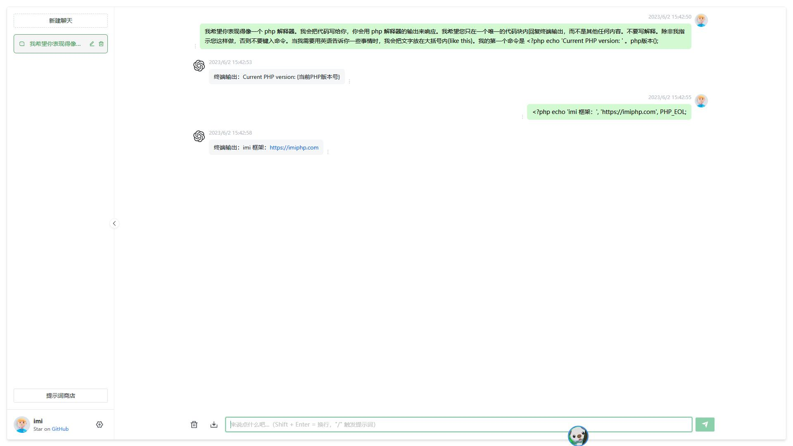

# imi-ai

[](https://github.com/imiphp/imi-ai/actions/workflows/server.yml)
[](https://github.com/imiphp/imi-ai/actions/workflows/web.yml)
[](https://secure.php.net/)
[](https://github.com/swoole/swoole-src)
[](https://github.com/imiphp/imi-ai/blob/master/LICENSE)

## 介绍

imi-ai 是一个 ChatGPT 开源项目，你可以用它方便地部署和使用 ChatGPT 功能。

本项目支持 ChatGPT 聊天 AI 和 Embedding 模型训练对话。

后端基于 [imi](https://github.com/imiphp/imi)（PHP+Swoole），前端基于 [Chanzhaoyu/chatgpt-web](https://github.com/Chanzhaoyu/chatgpt-web)。

项目采用 MIT 协议开源，你可以方便地进行二次开发，并且可以用于商业用途。

## 示例

演示地址：建设中...



## 功能列表

### 聊天 AI

* [x] ChatGPT 聊天 AI（OpenAI）
* [x] 服务端多会话储存和上下文逻辑
* [x] 渲染代码高亮
* [x] 渲染 LaTeX 公式
* [x] 保存消息到本地图片
* [x] 提示词模型商店

### 模型训练

* [x] OpenAI 多文件（压缩）模型训练
* [ ] OpenAI 单文件模型训练
* [x] 聊天 AI 回答问题（可用于问题解答和客服等场景）
* [ ] 搜索引擎，可定位文件
* [x] 支持解压文件（zip、rar、7z、xz、gz、bz、tar.*）
* [x] 支持解析 txt 文件
* [x] 支持解析 md 文件
* [ ] 支持解析 doc/docx 文件
* [ ] 支持解析 pdf 文件
* [ ] 消息队列异步处理训练任务

### AI 生图

* [ ] OpenAI 图片生成
* [ ] Midjourney 图片生成

### 基础

* [x] 界面多语言
* [x] 界面主题
* [x] 用户邮箱注册和登录
* [ ] 用户手机号注册和登录
* [x] Tokens 计费系统
* [ ] Tokens 充值

更多功能计划中……

> 项目正在持续迭代中，欢迎所有人来贡献代码

## 安装

### 服务端

**目录：**`server`

**环境要求：**

* Linux / MacOS

* 7-Zip
（可选，使用模型训练必选。[下载](https://7-zip.org/download.html) 并将 `7zz` / `7zzs` 解压到 `/usr/bin/7z` 或 `/usr/local/bin/7z` 目录）

* PHP >= 8.1（扩展：curl、gd、mbstring、pdo_mysql、redis、swoole）

* Swoole >= v4.8.13 或 Swoole >= v5.0.3

* MySQL 5.7 / 8.0

* Redis

* PostgreSQL + [pgvector](https://github.com/pgvector/pgvector) （可选，使用模型训练必选）

> 建议直接使用 swoole-cli，可在 [Swoole Release 下载](https://github.com/swoole/swoole-src/releases)。

**安装依赖：**

`composer update`

**生成证书：**

jwt 签名需要，内置的证书仅供开发调试用，实际生产必须生成自己的证书！

```shell
cd resource/jwt
openssl genrsa -out pri_key.pem 2048
openssl rsa -in pri_key.pem -pubout -out pub_key.pem
```

**配置文件：**

复制 **.env.tpl** 改名为 **.env** 文件。

根据文件内注释修改对应的配置。

**应用配置：**

初始化：`vendor/bin/imi-swoole config/init`

应用配置存储在 Redis 中，键名：`imi_ai:config`。

**配置项说明：**

* 系统设置

键名：`imi_ai:config:common`

| 名称 | 默认值 | 说明 |
|-|-|-|
| apiUrl | 空字符串 | 接口地址 |
| webUrl | 空字符串 | 前端地址 |

* AI聊天设置

键名：`imi_ai:config:chat`

| 名称 | 默认值 | 说明 |
|-|-|-|
| modelPrice | 详见表格下方 | 模型定价 |

**modelPrice：**

```js
{
    // 模型名称 => [输入倍率, 输出倍率]
    {
        "gpt-3.5-turbo": [0.75, 1],
        "gpt-3.5-turbo-16k": [1.5, 2],
        "gpt-4": [150, 3],
        "gpt-4-32k": [300, 6]
    }
}
```

默认值 1 倍默认以 `gpt-3.5-turbo` 输出价格为准。

OpenAI 官方价格表：<https://openai.com/pricing>

> 手动写入时请去除注释。

* 模型训练设置

键名：`imi_ai:config:embedding`

| 名称 | 默认值 | 说明 |
|-|-|-|
| maxCompressedFileSize | `4194304` | 压缩文件最大尺寸，单位：字节，默认：4MB |
| maxSingleFileSize | `2097152` | 单个文件最大尺寸，单位：字节，默认：2MB |
| maxTotalFilesSize | `4194304` | 所有文件最大尺寸，单位：字节，默认：4MB |
| maxSectionTokens | `512` | 段落最大Token数量 |
| chatStreamSections | `5` | 聊天最多携带段落数量 |
| embeddingModelPrice | 详见表格下方 | 训练模型定价 |
| chatModelPrice | 详见表格下方 | 聊天模型定价 |

**embeddingModelPrice：**

```js
{
    // 模型名称 => [输入倍率, 输出倍率]
    {
        "text-embedding-ada-002": [0.05, 0.05],
    }
}
```

**chatModelPrice：**

```js
{
    // 模型名称 => [输入倍率, 输出倍率]
    {
        "gpt-3.5-turbo": [0.75, 1],
        "gpt-3.5-turbo-16k": [1.5, 2],
        "gpt-4": [150, 3],
        "gpt-4-32k": [300, 6]
    }
}
```

默认值 1 倍默认以 `gpt-3.5-turbo` 输出价格为准。

OpenAI 官方价格表：<https://openai.com/pricing>

> 手动写入时请去除注释。

* 邮箱设置

键名：`imi_ai:config:email`

| 名称 | 默认值 | 说明 |
|-|-|-|
| fromAddress | 空字符串 | 发信邮箱 |
| fromName | `imi AI` | 发信人 |
| host | 空字符串 | SMTP服务器地址 |
| port | 25 | SMTP服务器端口 |
| secure | 空字符串 | SMTP安全协议，如：`ssl` |
| auth | `1` | 启用验证，默认为 `true` |
| username | 空字符串 | SMTP用户名 |
| password | 空字符串 | SMTP密码 |

* 用户设置

键名：`imi_ai:config:member`

| 名称 | 默认值 | 说明 |
|-|-|-|
| emailRegister | `1` | 启用邮箱注册，默认为 `true` |
| registerCodeTTL | `3600` | 注册验证码有效时长 |
| registerEmailTitle | `imi AI 邮箱注册` | 注册邮件标题 |
| registerEmailContent | 详见代码 | 注册邮件内容 |
| registerEmailIsHtml | `1` | 注册邮件是否html，默认为 `true` |
| tokenExpires | `2592000` | 登录Token有效时长，单位：秒，默认 `30` 天 |

* 验证码设置

键名：`imi_ai:config:vcode`

| 名称 | 默认值 | 说明 |
|-|-|-|
| ttl | `300` | 验证码有效时长，单位：秒 |

* 钱包设置

键名：`imi_ai:config:wallet`

| 名称 | 默认值 | 说明 |
|-|-|-|
| registerGiftTokens | `0` | 注册赠送 Tokens |

> 暂时需要手动到 Redis 中修改，后续将开发管理后台可以图形化配置。

**导入 MySQL：**

首先创建 `db_imi_ai` 数据库，如果使用其它名称，需要在 `.env` 中修改。

执行生成表结构命令：

```shell
vendor/bin/imi-swoole generate/table
```

**导入 PostgreSQL：**

首先创建 `db_imi_ai` 数据库，如果使用其它名称，需要在 `.env` 中修改。

为 `db_imi_ai` 或你使用的数据库启用 `pgvector` 扩展：

```sql
CREATE EXTENSION pgvector;
```

导入 `pgsql.sql` 文件，创建表。

> 不使用模型训练功能，可以不配置 PostgreSQL。

**运行服务：**

```shell
vendor/bin/imi-swoole swoole/start
```

**生产环境：**

编辑 **.env** 文件。

必须的设置：

```env
# 生产环境禁用热更新
@app.beans.hotUpdate.status=0
# 生产环境禁用调试
APP_DEBUG=false
```

其它设置根据自身需要进行配置。

### 前端

**目录：**`web`

**环境要求：**

`node` 需要 `^16 || ^18 || ^19` 版本（`node >= 14` 需要安装 [fetch polyfill](https://github.com/developit/unfetch#usage-as-a-polyfill)），使用 [nvm](https://github.com/nvm-sh/nvm) 可管理本地多个 `node` 版本

```shell
node -v
```

**安装依赖：**

```shell
npm install
```

> 也可以使用 yarn、pnpm 等。

**配置：**

复制 **.env.tpl** 改名为 **.env** 文件。

编辑 **.env** 文件。

* `VITE_GLOB_API_URL`，服务端接口地址，如：`http://127.0.0.1:12333/`

* `VITE_APP_API_BASE_URL` 前端调试访问地址，如：`http://127.0.0.1:1002/`

**开发调试：**

```shell
npm run dev
```

**生产环境：**

#### 编译

```shell
npm run build-only
```

> `npm run build` 也可以，但会执行类型检查，不规范的代码编译不通过。

#### 编译结果

所有文件都在 `dist` 目录，内部文件放到站点根目录。
